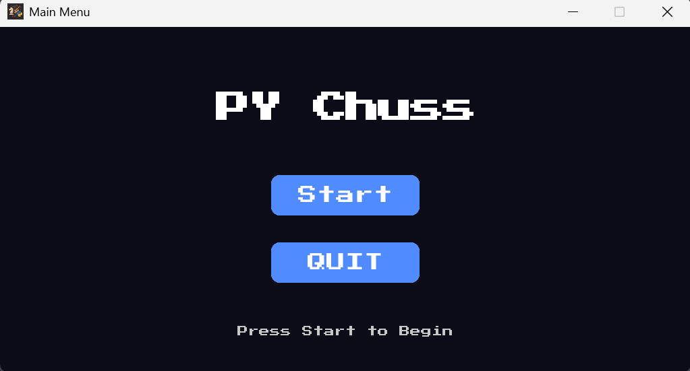
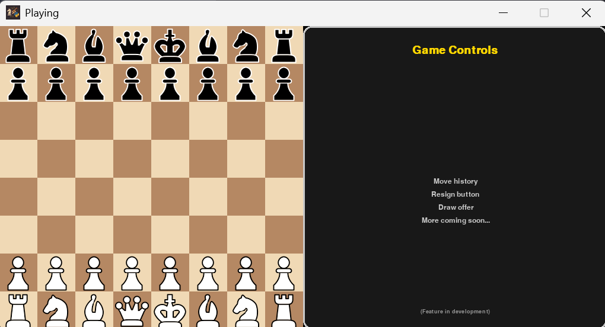
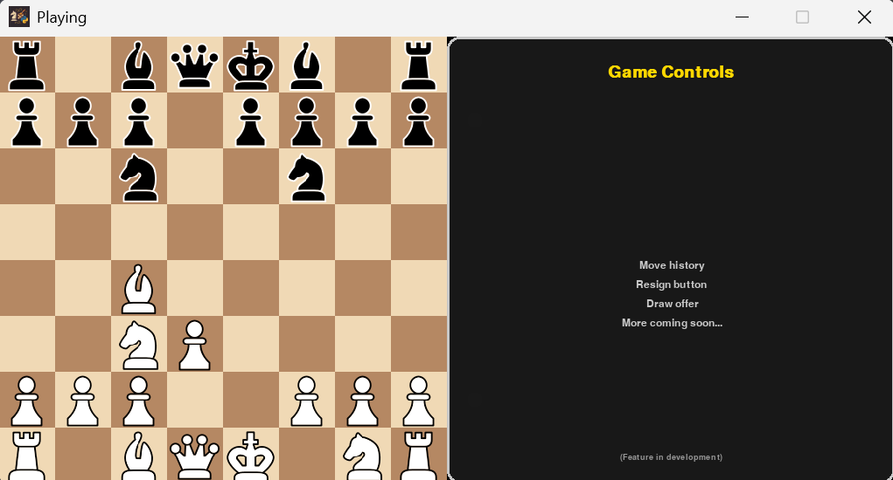
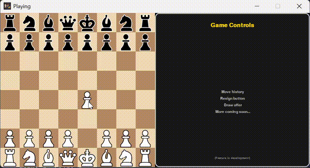

<p align="center">
  
</p>

<h1 align="center">♜ PyChuss – Python Chess with Pygame</h1>

<p align="center">
  <b>A modern, open-source chess game built in Python with Pygame.<br>
  Full rules, modular UI, and pixel-art style pieces.</b>
</p>

<p align="center">
  
  
  
  
</p>

---

## 🎮 Demo

<p align="center">
  
  
  
</p>

<p align="center">
  
</p>

---

## 🧠 About

**PyChuss** is an object-oriented chess game designed to be both _playable_ and _hackable_.  
It supports the full chess ruleset (except en passant, in progress) and comes with a modular scene-based UI.

Built for anyone who wants to:

- Play a clean, lightweight chess game in Python
- Explore **chess logic** (check, checkmate, castling, promotion)
- Learn **event-driven game loops** with Pygame
- Reuse a **scene-based UI framework** for other projects

---

## 🧱 Features

- ♟️ Mouse-driven interactive chessboard
- ♚ All standard chess rules (castling, promotion, checkmate)
- ⚔️ Capturing + accurate piece movement
- 🖼️ Pixel-art sprites + custom font
- 🔄 Scene-based UI system (menu, gameplay, pause)
- 🧩 Clean OOP codebase (easy to extend / mod)

---

## 🚧 Roadmap

- Add **en passant** rule
- Detect **stalemate/draw** conditions
- Improve **UI polish** (animations, win screen, restart menu)
- Smarter **output logging/debugging**

---

## 🛠 Tech Stack

| Tool      | Purpose                   |
| --------- | ------------------------- |
| 🐍 Python | Core programming language |
| 🎮 Pygame | Rendering & input         |
| 🌀 Git    | Source control            |
| 📜 rich   | Debug/logging             |

---

## 📂 Project Structure

```bash
PyChuss/
├── assets/        # Piece sprites, font, UI images
│   ├── black/
│   ├── white/
│   ├── font/
│   └── move.png
├── Scenes/        # Menu & game scenes
│   ├── game_scene.py
│   ├── main_menu.py
│   ├── pause_menu.py
│   └── scene.py
├── UI/            # Reusable UI components
│   ├── button.py
│   ├── label.py
│   └── panel.py
├── board.py       # Core chessboard logic
├── pieces.py      # Piece movement + rules
├── player.py      # Player/turn management
├── settings.py    # Config/settings
├── main.py        # Entry point – game loop
├── icon.png       # Game icon
├── readme.md      # This file
└── description.md # Extra project notes
```

---

## 🚀 Getting Started

1. **Install dependencies:**

   ```bash
   pip install pygame,rich
   ```

2. **Run the game:**

   ```bash
   python main.py
   ```

> **Note:** Works best with Python 3.10+.  
> Ensure your assets are in place for sprites to load correctly.

## ⚖️ License

This project is under the MIT License.
Use it, learn from it, hack it—but don’t resell as your own.

## 🤝 Contribute

This is my first attempt at making a **bigger Python project**, so the code isn’t perfect and there’s plenty of room to grow.  
If you notice issues, want to add features (like AI opponents, better UI, or online play), or just feel like cleaning up code—contributions are welcome.

Fork it, open a PR, or drop suggestions in issues.  
And if you just like the project, a ⭐ star would mean a lot.
